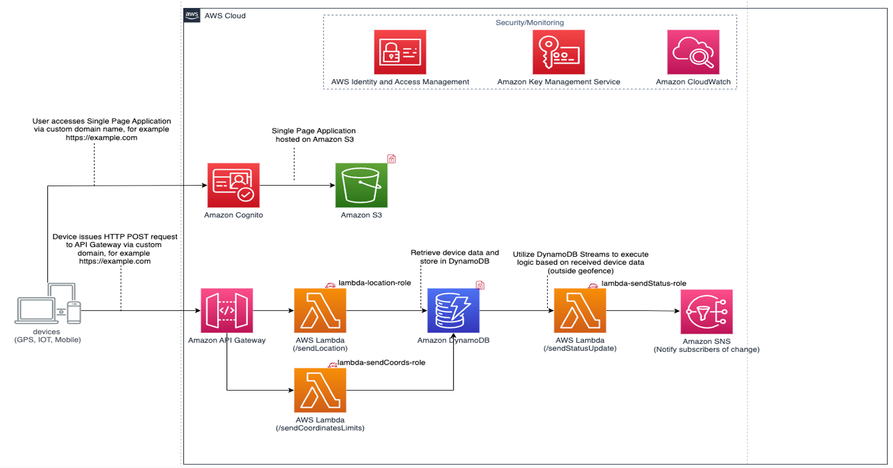

<!-- PROJECT LOGO -->
 

  

<h3 align="center">moove-baas</h3>

  

    Real time device tracking for small-mid sized device groups
     
    <a href="https://github.com/walimorris/intelli-crop-frontend"><strong>Frontend Repo Coming Soon! »</strong></a>
     
     
    ·
    <a href="https://github.com/walimorris/moove-baas/issues">Report Bug</a>
    ·
    <a href="https://github.com/walimorris/moove-baas/pulls">Request Feature</a>
  

# Moove
***
## High Level Overview
AWS Serverless solution that streams real time location data to Amazon DynamoDB and updates a UI tracker.
The POC usecase is for small - medium size cattle ranches.

### Built With
* [![React][React.js]][React-url]
* [![AWS][AWS.com]][AWS-url]

Here are the technologies used in this project: 
* [Amazon Cognito](https://aws.amazon.com/cognito/) Implement secure, frictionless customer identity and access
management that scales
* [AWS S3](https://aws.amazon.com/s3/) Object Storage built to retrieve any amount of data from anywhere
* [AWS Lambda](https://aws.amazon.com/lambda/) Run code without thinking about servers or clusters
* [Amazon DynamoDB](https://aws.amazon.com/dynamodb/) Fast, flexible NoSQL database service for single digit millisecond
performance at any scale
* [Amazon API Gateway](https://aws.amazon.com/api-gateway/) Create, maintain, and secure APIs at any scale
* [Amazon Simple Notification Service](https://aws.amazon.com/sns/) Fully managed Pub/Sub service for A2A and A2P messaging
***

<!-- MARKDOWN LINKS & IMAGES -->
<!-- https://www.markdownguide.org/basic-syntax/#reference-style-links -->
[license-shield]: https://img.shields.io/github/license/github_username/repo_name.svg?style=for-the-badge
[license-url]: https://github.com/github_username/repo_name/blob/master/LICENSE.txt
[linkedin-shield]: https://img.shields.io/badge/-LinkedIn-black.svg?style=for-the-badge&logo=linkedin&colorB=555
[linkedin-url]: https://www.linkedin.com/in/wali-m/
[product-screenshot]: images/screenshot.png
[React.js]: https://img.shields.io/badge/React-20232A?style=for-the-badge&logo=react&logoColor=61DAFB
[React-url]: https://reactjs.org/
[Springboot.com]: https://img.shields.io/badge/Springboot-4B6F44?style=for-the-badge&logo=springboot&logoColor=white
[Springboot-url]: https://spring.io
[AWS.com]: https://img.shields.io/badge/AWS-FF9900?style=for-the-badge&logo=amazon&logoColor=000000
[AWS-url]: https://aws.amazon.com/
